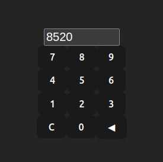

# Gecko


Gecko is a JSX code generation framework for TypeScript.

## Prerequisites

Gecko is written in TypeScript, and requires [tsx](https://www.npmjs.com/package/tsx).

[Bun](https://bun.sh/) support is planned.

## Example: React + Vite front end

To test Gecko, run the following from this repository's root folder:

```
npm install
cd examples/calculator
npm --prefix project install
npm run gecko
npm --prefix project run dev
```

Gecko should run and generate files in the `./examples/calculator/project/src/gecko_generated` folder.

If there were no errors during the Gecko or Vite build, the calculator example will be available at http://localhost:5173 that looks like this:



## Example: Express REST API

To start the API, first run Gecko and then launch the resulting API:

```
npm install
cd examples/rest-api
npm install
npm --prefix project install
npm run gecko
npm --prefix project start
```

If there were no errors encountered, you should be able to visit http://localhost:3000/users and see a list of users:

```
[
  {
    "id": "1",
    "name": "Test user",
    "email": "test@example.com"
  }
]
```

## Project structure

Projects using Gecko should have the following structure:

```
├── gecko.tsx
├── package.json
├── project
│   ├── (your project files)
│   ├── package.json
└── templates
    └── example.tsx
```

Your entire project source code, including its `package.json`, `tsconfig.json`, etc must be in the `./project` sub-folder. This is important because the `gecko.tsx` template file must be isolated from your project's own TypeScript configuration. It will run under Gecko's internal `tsconfig.json`.

## Reference

Gecko uses a file named `gecko.tsx` at the root of your project to generate files. The file contents might look something like:

```jsx
import {
  File,
  Folder,
  geckoJSX,
  Root,
  Text,
} from '@flatfile/gecko'

import { Button } from './templates/Button'

export default function () {
  return (
    <Root path="project/src/gecko_generated" erase>
      <File name="readme.md">
        <Text>Hello world</Text>
      </File>
      <Folder name="components">
        {[0, 1, 2, 3, 4, 5, 6, 7, 8, 9].map((digit) => (
          <File name={`Digit${digit}.tsx`}>
            <Button label={digit} />
          </File>
        ))}
      </Folder>
    </Root>
  )
}
```

Gecko supports many JSX tags to structure generated code:

### `<Root>`

This tag should wrap all other tags used. It specifies the location of generated folders and files on disk with `path="path/to/generated/content"`. If the `erase` attribute is present, the folder path specified will be erased on each build. Use `erase` with extreme caution!

### `<Folder>`

A folder. Takes a `name="myFolderName"` property. This tag may contain other `<Folder>` or `<File>` tags as children.

### `<File>`

A file. Takes a `name="fileName.ext"` argument. Children of this tag will be the contents written to the file. You may specify the attribute `once` to ensure that the file is only generated if it does not already exist. This is useful for files that must be manually modified after being generated.

Example:

```jsx
<File name="README.md" once>
  <Text>
    This file is generated only once, and then may be
    manually edited without being overwritten by Gecko later
  </Text>
</File>
```

### `<Afterwards>`

Content to write to disk or operations to perform after all other content is written to disk. Takes a callback function, with access to a `GeckoSource` instance as the first argument. Use the `match` function to get files matching a given regular expression. To match all files, pass undefined or an empty regular expression.

Example:

```jsx
<Afterwards>
  {(s: GeckoSource) => (
    <File name="digits.md">
      {s.match(/Digit\d\.tsx$/).map((file) => (
        <Text>
          Component '
          {
            file.pathSegments?.[
              file.pathSegments.length - 1
            ]
          }
          '
        </Text>
      ))}
    </File>
  )}
</Afterwards>
```

### The following may only be used within a `<File>`

### `<Class>`

A class.

Optional flags (attributes) include `export` to export the class and `abstract` for abstract classes. May be exported as default with `export="default"` or exported as named with `export name="MyClass"`.

Example:

```jsx
<Class
  export
  name="User"
  extends="BaseModel"
  implements="AuthProvider"
>
  ... class implementation ...
</Class>
```

### `<Collect>` and `<Part>`

Collect all `<Part>`s matching a tag.

Example:

_earlier..._

```
<Part tag="readme">
 <Text>This is part of the readme</Text>
</Part>
```

_later..._

```
<File name="readme.md">
 <Text># My Project</Text>
 <Text />
 <Collect tag="readme" />
</File>
```

Produces the following `readme.md` file:

```
# My Project

This is part of the readme
```

### `<Export>`

An export statement, which re-exports.

Example:

```jsx
<Export all as='React' from 'react' />
<Export type named={[ 'ReactDOM' ]} from 'react' />
```

### `<Function>`

A function. May be exported as default with `export="default"` or exported as named with `export name="myFunctionName"`.

### `<Import>`

An import statement.

Example:

```jsx
<Import default='React' from='react' />
<Import type named={[ 'ReactDOM' ]} from='react' />
```

### `<Interface>`

A TypeScript interface type.

Example:

```jsx
<Interface export name="MyComponentProps">
  <Method name="onClick" returnType="void" />
  <Property name="count" type="number" required />
</Interface>
```

### `<Method>`

A class method. May only be used inside of a `<Class>` element.

Example:

```jsx
<Method
  name="getUser"
  async
  arguments={['id: string']}
  returnType="Promise<User>"
>
  {'// implementation here'}
</Method>
```

### `<Object>`

An object.

Example:

```jsx
<Object>
  <Property name="id">123</Property>
  <Property name="name">{"'John Doe'"}</Property>
  <Property name="email">
    {"'john.doe@example.com'"}
  </Property>
</Object>
```

Produces:

```js
{
  id: 123,
  name: 'John Doe',
  email: 'john.doe@example.com'
}
```

### `<Property>`

A class property. May only be used inside of a `<Class>` element.

Flags (attributes) include at most one of `private`, `protected`, or `public`, and optionally `readonly` or `static`.

Example:

```jsx
<Property
  private
  name="count"
  type="number"
  value="4"
  required
/>
```

### `<Get>` and `<Set>`

Class property accessors. `<Get>` creates a getter function and `<Set>` creates a setter function. Both of these may only be used inside of a `<Class>` element.

Flags (attributes) include at most one of `private`, `protected`, or `public`.

```jsx
<Get protected name="foo">
  {'return 4'}
</Get>
```

```jsx
<Set public name="foo" argument="value: number">
  {'this.fooInternal = value'}
</Set>
```

### `<Text>`

Plain text to be written to a file. Adjacent `<Text>` or `<Function>` tags within a `<File>` are separated by a new line.

### `<Type>`

A TypeScript type.

Example:

```jsx
<Type export name="Digit">
  {
    "'0' | '1' | '2' | '3' | '4' | '5' | '6' | '7' | '8' | '9'"
  }
</Type>
```

Produces:

```js
export type Digit = '0' | '1' | '2' | '3' | '4' | '5' | '6' | '7' | '8' | '9'
```

### `<Variable>`

A variable.

Example:

```jsx
<>
  <Variable export name="title" type="string">
    {'My Title'}
  </Variable>
  <Variable export mutable name="count" type="number">
    4
  </Variable>
</>
```

Produces:

```js
export const title = 'My Title'
export let count = 4
```
